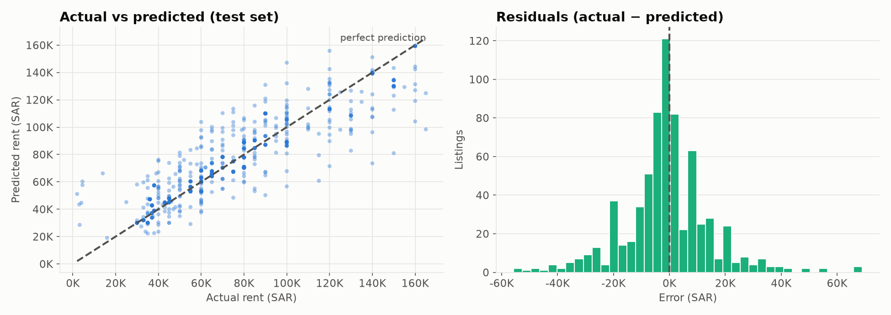
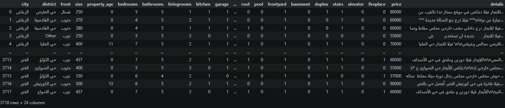
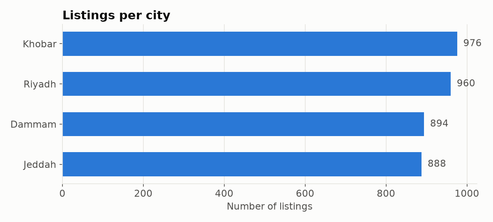
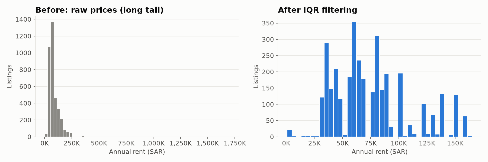
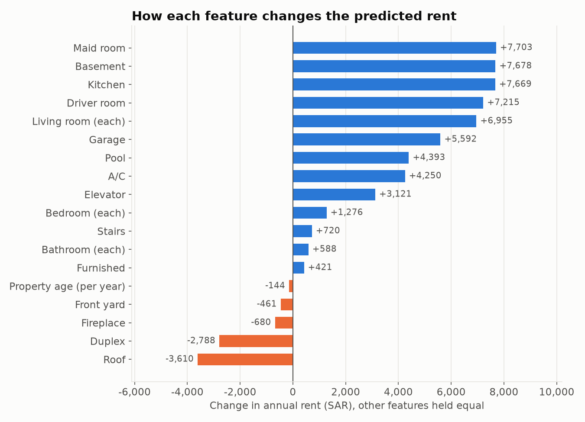
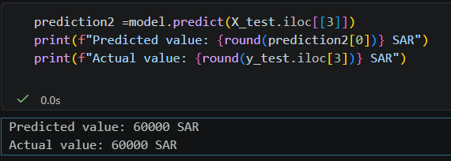
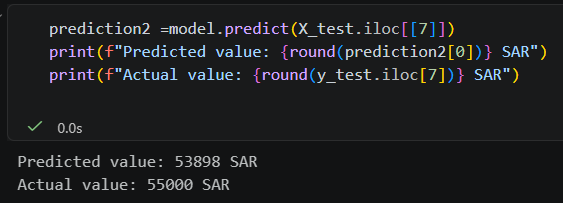
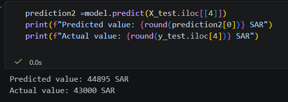

# 🏠 Aqar Price Prediction

A machine learning project that predicts **annual villa rent prices in Saudi Arabia** from listings on the Aqar real-estate platform. It uses features such as size, number of rooms, amenities, city and district.



## 📌 Highlights

| | |
|---|---|
| **Dataset** | 3,718 real rental listings from Riyadh, Jeddah, Dammam and Khobar |
| **Model** | Linear Regression (Scikit-Learn) |
| **Test R²** | **0.795** |
| **Mean absolute error** | ~10,700 SAR per year |

## 🗂️ The Data

This is **real-world data**, not synthetic: every row is an actual rental ad posted on [Aqar](https://sa.aqar.fm), one of Saudi Arabia's largest real-estate platforms. The prices, features and ad descriptions are exactly as the owners and agents published them.

The dataset (`SA_Aqar.csv`) contains 24 columns for each listing: city, district, street frontage direction, size (m²), property age, room counts (bedrooms, bathrooms, living rooms, kitchen), amenities (pool, elevator, garage, A/C, basement…), the free-text ad description, and the annual rent in SAR.



The four cities are almost evenly represented:



## ⚙️ Approach

1. **Data cleaning.** The only column with missing values is `details` (the free-text ad description, 80 empty rows). It is not used as a model input, so it was dropped.
2. **Grouping districts.** The dataset has hundreds of districts, and many appear only a few times. We kept the 100 districts with the highest total rent and grouped the rest into a single `Other` category, which reduces noise and overfitting.
3. **Outlier handling.** Rents range up to 1.7M SAR, with a long tail of extreme listings. We used the Interquartile Range (IQR) rule to remove them, keeping **3,476 of 3,718** listings (rents up to 167,500 SAR).

   

4. **Encoding.** One-Hot Encoding (`drop_first=True`) turned `city`, `front` and `district` into numeric columns without creating redundant ones.
5. **Modeling.** We trained a Linear Regression model on an 80/20 train/test split (`random_state=42`). Linear Regression makes each feature's effect easy to read.

## 📊 Results

| Split | R² | MAE (SAR) |
|---|---|---|
| Train | 0.789 | 9,705 |
| Test  | 0.795 | 10,727 |

- **Actual vs predicted:** the points follow the perfect-prediction line closely across the whole price range (see the chart at the top).
- **Residuals:** errors are centered on zero and roughly symmetric, so the model does not systematically over- or under-price.

### What drives the rent?

Because the model is linear, each coefficient shows how much a feature adds to or subtracts from the predicted annual rent, with everything else held equal:



A maid room, basement, kitchen or driver room each adds roughly **7,000–7,700 SAR/year**. Each year of property age lowers the predicted rent by about **144 SAR**. Location (city and district) has an even bigger effect: some districts shift the predicted rent by more than **±50,000 SAR**.

### Sample predictions

Three listings from the test set, with the model's prediction next to the real rent:

<table>
  <tr>
    <td></td>
    <td></td>
    <td></td>
  </tr>
</table>

### Example prediction

A 300 m², 5-year-old villa in Jeddah with 5 bedrooms, 4 bathrooms, a pool, a garage and driver and maid rooms:

```
Predicted annual rent: 108,574.61 SAR
```

## 🚀 How to Run

```bash
pip install pandas numpy matplotlib scikit-learn jupyter
jupyter notebook "Team#6_AQAR_Project.ipynb"
```

Keep `SA_Aqar.csv` in the same folder as the notebook. You can also open the notebook in **Google Colab** and upload the CSV.

## 🛠️ Technologies

- **Language:** Python
- **Libraries:** Pandas, NumPy, Scikit-Learn
- **Visualization:** Matplotlib
- **Environment:** Jupyter Notebook / Google Colab

## 📁 Project Structure

```
├── Team#6_AQAR_Project.ipynb              # Full analysis and model
├── SA_Aqar.csv                            # Dataset
├── Data Science Project by Penta Team.pdf # Project presentation
├── images/                                # Charts used in this README
└── README.md
```

## 👥 Team Penta's Members

- **Abdullah bin Maneea** (Leader)
- **Abdullah AlOud**
- **Faris Abuthnain**
- **Mohammad Alaqid**
- **Malik Alhabashi**
